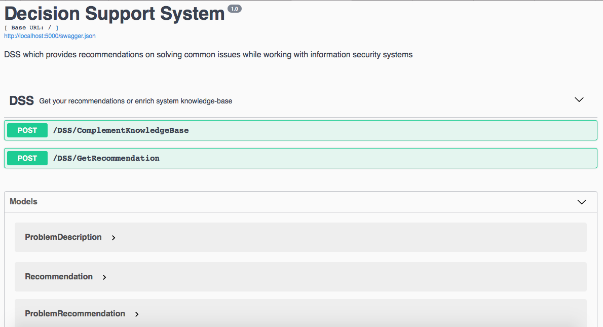

# Decision Support System

Basic structure implemented. There're two API methods:
1. /GetRecommendation which gets problem description in log or stdout text format and returns recommendation (text too).  
2. /ComplementKnowledgeBase which gets problem resume (problem keywords) with suitable recommendation and saves it to knowledge base  

Further instead of mock knowledge base there will be complete inference engine with knowledge base (comprised of rules, probably)  

API documentation is powered by OpenAPI Swagger.  
